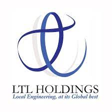

# Education

## University of Peradeniya

Completed the Bachelor of Science in Engineering (Hons) degree specializing in Mechanical Engineering. Obtained First Class Honours while securing a cumulative GPA of 3.9/4.0.

### Awards and Honours

*   The Channa Lalith Maddumage Prize for the Best Performance in Mechanical Engineering - To be awarded at the General Convocation, University of Peradeniya

*   The S. Mahalingam Prize for Mechanics of Machines - To be awarded at the General Convocation, University of Peradeniya

*   The M. Amaratunga Prize for Strength of Materials - To be awarded at the General Convocation, University of Peradeniya

*   The Migara Ratnatunga Trust Award for the Best Undergraduate Internship in Mechanical Engineering - Awarded by the Institution of Engineers Sri Lanka (IESL) - _2022_
*   Dr. Tilak Peiris Award for the best performance in the General Programme of Engineering - Awarded by the Peradeniya Engineering Faculty Alumni Association (PEFAA) - _2017_
*   Scholarship for Best Individual Performance at the First Examination, Faculty of Engineering - Awarded by the Peradeniya University Alumni Association of New South Wales (PUAAN) - _2017_
*   Mahapola Merit Scholarship for exceptional performance at the G.C.E Advanced Level Examination - Awarded by the University Grants Commission of Sri Lanka - _2016_

## Trinity College Kandy

Completed the G.C.E Advanced Level Examination in the Physical Science stream and gained entrance to the Faculty of Engineering, University of Peradeniya.

| Subject  | Result  |
| :--- | :---: |
| Combined Mathematics  | A  |
| Physics  | A |
| Chemistry  | A |
| General English  | A |

District Rank - 9  
Country Rank - 143   
Z Score - 2.453   

<a href="docs/AL_Certificate.pdf" target="_blank">View Certificate >></a>

<!-- <a href="docs/Dockyard_Certificate.pdf" target="_blank">PDF.</a> -->

<!-- [View Training Certificate >>](./docs/Dockyard_Certificate.pdf) -->

<!--  -->

<!-- <embed src="https://rajinthss.github.io/docs/Dockyard_Certificate.pdf" type="application/pdf" width="100%" height="850px"/> -->

<!-- https://docs.google.com/viewer?url=https://drive.google.com/file/d/1nY8tLiqciS3rqbdKoQy9h8330Bv6hLX6/view?usp=sharing -->

### Awards and Honours

*   Award for Outstanding Performance at the G.C.E Advanced Level Examination	- Awarded by Trinity College, Kandy - _2016_

[Back to Homepage](./)
