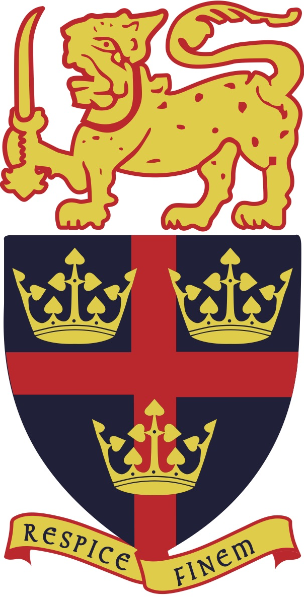

# About Me

Hello there! I am a recent mechanical engineering graduate of the University of Peradeniya, Sri Lanka. Currently I am working as a temporary instructor at my alma mater with the aim of pursuing higher studies. My research interests span fluid dynamics, control systems and artificial intelligence, and more overlap the better. I am keen on being involved in research which not only are novel, but also have significant real world impact.

Scroll down to take a look at my background.

# Education


|| <span style="font-weight:normal">**Faculty of Engineering, University of Peradeniya** <br/> BSc. Engineering (Hons) - October 2021<br/> Mechanical Engineering <br/> GPA: 3.9/4.</span>|
|:---:|:-------------------------|
|  | **Trinity College Kandy** <br/> GCE Advanced Level Examintation - August 2015 <br/> Physical Science Stream <br/> Distric Rank: 9 (Kandy)|

<table>
      <tr><td></td><td> **Faculty of Engineering, University of Peradeniya** <br/> BSc. Engineering (Hons) - October 2021<br/> Mechanical Engineering <br/> GPA: 3.9/4.0</td></tr>
      <tr><td> </td><td>**Trinity College Kandy** <br/> GCE Advanced Level Examintation - August 2015 <br/> Physical Science Stream <br/> Distric Rank: 9 (Kandy)</td></tr>
</table>

## Header 2

> This is a blockquote following a header.
>
> When something is important enough, you do it even if the odds are not in your favor.

### Header 3

```js
// Javascript code with syntax highlighting.
var fun = function lang(l) {
  dateformat.i18n = require('./lang/' + l)
  return true;
}
```

```ruby
# Ruby code with syntax highlighting
GitHubPages::Dependencies.gems.each do |gem, version|
  s.add_dependency(gem, "= #{version}")
end
```

#### Header 4

*   This is an unordered list following a header.
*   This is an unordered list following a header.
*   This is an unordered list following a header.

##### Header 5

1.  This is an ordered list following a header.
2.  This is an ordered list following a header.
3.  This is an ordered list following a header.

###### Header 6

| head1        | head two          | three |
|:-------------|:------------------|:------|
| ok           | good swedish fish | nice  |
| out of stock | good and plenty   | nice  |
| ok           | good `oreos`      | hmm   |
| ok           | good `zoute` drop | yumm  |

### There's a horizontal rule below this.

* * *

### Here is an unordered list:

*   Item foo
*   Item bar
*   Item baz
*   Item zip

### And an ordered list:

1.  Item one
1.  Item two
1.  Item three
1.  Item four

### And a nested list:

- level 1 item
  - level 2 item
  - level 2 item
    - level 3 item
    - level 3 item
- level 1 item
  - level 2 item
  - level 2 item
  - level 2 item
- level 1 item
  - level 2 item
  - level 2 item
- level 1 item

### Small image


### Large image


### Definition lists can be used with HTML syntax.

<dl>
<dt>Name</dt>
<dd>Godzilla</dd>
<dt>Born</dt>
<dd>1952</dd>
<dt>Birthplace</dt>
<dd>Japan</dd>
<dt>Color</dt>
<dd>Green</dd>
</dl>

```
Long, single-line code blocks should not wrap. They should horizontally scroll if they are too long. This line should be long enough to demonstrate this.
```

```
The final element.
```

Text can be **bold**, _italic_, or ~~strikethrough~~.

[Link to another page](./another-page.html).

There should be whitespace between paragraphs.

There should be whitespace between paragraphs. We recommend including a README, or a file with information about your project.
