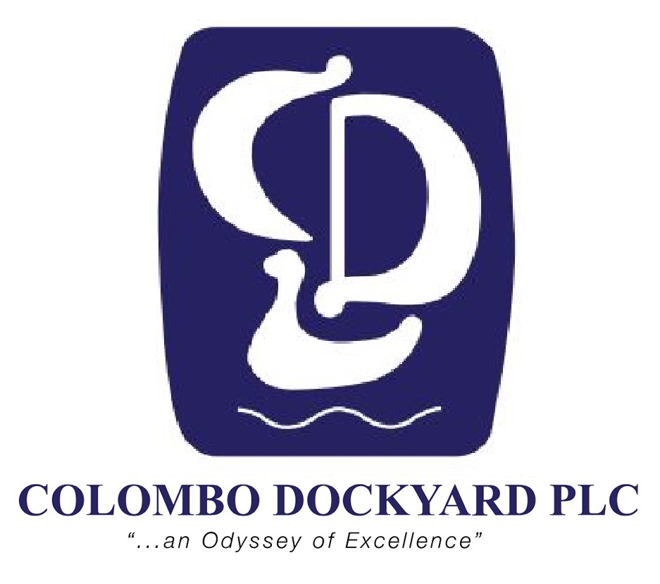

# About Me

Hello there! I am a recent mechanical engineering graduate of the University of Peradeniya, Sri Lanka. Currently I am working as a temporary instructor at UoP with the aim of pursuing higher studies. My research interests span fluid dynamics, control systems and artificial intelligence, and more the overlap the better. I am keen on being involved in research which not only are novel, but also have significant real world impact.

Scroll down to take a look at what I've been up to...

# Education

| <!-- --> | <!-- --> |
|:---:|:-------------------------|
|<a href="https://www.pdn.ac.lk/" class="image fit" target="_blank"></a>| <span style="font-weight:normal">**Faculty of Engineering, University of Peradeniya** <br/> BSc. Engineering (Hons) - September 2021<br/> Mechanical Engineering <br/> GPA: 3.9/4.0</span>|
|:---:|:-------------------------|
|<a href="https://www.trinitycollege.lk/" class="image fit" target="_blank"></a>| **Trinity College Kandy** <br/> G.C.E Advanced Level Examination - August 2015 <br/> Physical Science Stream <br/> District Rank: 9 (Kandy)|

<!--[Read More >>](./education.html)-->

<div style="text-align: right"> <p class="view"><a href="https://rajinthss.github.io/education.html"> Read More >> </a></p> </div>

# Work Experience

| <!-- --> | <!-- --> |
|:---:|:-------------------------|
|<a href="https://www.pdn.ac.lk/" class="image fit" target="_blank"></a>| <span style="font-weight:normal">**Faculty of Engineering, University of Peradeniya** <br/> Temporary Instructor (Equivalent to Teaching Assistant) <br/> Department of Mechanical Engineering <br/> _October 2021 to Present_|
|:---:|:-------------------------|
|<a href="https://ltl.lk/" class="image fit" target="_blank"></a>| <span style="font-weight:normal">**LTL Holdings (Pvt.) Ltd.** <br/> Engineering Intern <br/> Yugadanavi Combined Cycle Power Plant <br/> _November 2019 to February 2020_|
|:---:|:-------------------------|
|<a href="https://www.cdl.lk/" class="image fit" target="_blank"></a> | **Colombo Dockyard PLC** <br/> Engineering Intern <br/> CDPLC Training Division <br/> _February 2019 to May 2019_|

<div style="text-align: right"> <p class="view"><a href="https://rajinthss.github.io/work_experience.html"> Read More >> </a></p> </div>

# Research Projects

| <!-- --> |
|:---|
|<span style="font-weight:normal">**Performance Analysis of a Wave Energy Converter using Smoothed Particle Hydrodynamicss** <br/> Independent research project supervised by <a href="http://eng.pdn.ac.lk/ME/People/FacultyProfiles.php?id=4" target="_blank"> Prof. S.D.G.S.P. Gunawardane </a> and <a href="http://eng.pdn.ac.lk/ME/People/FacultyProfiles.php?id=10" target="_blank"> Dr. U.A. Higgoda </a> <br/> _January 2022 to Present_|
|:---:|
|<span style="font-weight:normal">**Design and Comparison of Sensorless Field Oriented Control Drive for Brushless DC Motors** <br/> Final year individual project supervised by <a href="https://scholar.google.com/citations?user=EQjg8fsAAAAJ&hl=en" target="_blank"> Dr. D.H.S. Maithripala </a> <br/> _October 2020 to September 2021_|
|:---:|
|<span style="font-weight:normal">**Atlas: A Wearable Posture Monitoring  and Correcting Device**<br/> Third year group project supervised by <a href="https://www.linkedin.com/in/lalithwick/?originalSubdomain=lk" target="_blank"> Dr. L.N. Wickramarathna </a> <br/> _January 2020 to October 2020_|

<div style="text-align: right"> <p class="view"><a href="https://rajinthss.github.io/projects.html"> Read More >> </a></p> </div>

# Publications

| <!-- --> |
|:---|
|<span style="font-weight:normal">**Design of a Sensorless Field Oriented Control Drive for Brushless DC Motors** <br/> S. Rajinth, C. Abyekoon, D.H.S. Maithripala <br/> 9th International Conference of Control, Dynamic Systems, and Robotics (CDSR’22) <br/> June 2, 2022 - June 4, 2022, Niagara Falls, Canada <br/> _Accepted and Pending Publication_|
|:---:|
|<span style="font-weight:normal">**Design and Realization of a Wearable Posture Correcting Device**<br/> S. Rajinth, G.H.M.C.M.B. Herath, H.M. Gammulle, L.N. Wickramarathna <br/> IEEE EMBS International Student Conference (ISC 2021) <br/> Moratuwa, Sri Lanka, Feb. 2021  <br/>_Presented and Published in Conference Proceedings_|

<div style="text-align: right"> <p class="view"><a href="https://rajinthss.github.io/projects.html"> Read More >> </a></p> </div>

<!--
# Beyond Academics

A display of all the extra things I found myself doing over the years..

<div style="text-align: right"> <p class="view"><a href="https://rajinthss.github.io/projects.html"> Read More >> </a></p> </div>


<!--
## Header

> This is a blockquote following a header.
>
> When something is important enough, you do it even if the odds are not in your favor.

### Header 3

```js
// Javascript code with syntax highlighting.
var fun = function lang(l) {
  dateformat.i18n = require('./lang/' + l)
  return true;
}
```

```ruby
# Ruby code with syntax highlighting
GitHubPages::Dependencies.gems.each do |gem, version|
  s.add_dependency(gem, "= #{version}")
end
```

#### Header 4

*   This is an unordered list following a header.
*   This is an unordered list following a header.
*   This is an unordered list following a header.

##### Header 5

1.  This is an ordered list following a header.
2.  This is an ordered list following a header.
3.  This is an ordered list following a header.

###### Header 6

| head1        | head two          | three |
|:-------------|:------------------|:------|
| ok           | good swedish fish | nice  |
| out of stock | good and plenty   | nice  |
| ok           | good `oreos`      | hmm   |
| ok           | good `zoute` drop | yumm  |

### There's a horizontal rule below this.

* * *

### Here is an unordered list:

*   Item foo
*   Item bar
*   Item baz
*   Item zip

### And an ordered list:

1.  Item one
1.  Item two
1.  Item three
1.  Item four

### And a nested list:

- level 1 item
  - level 2 item
  - level 2 item
    - level 3 item
    - level 3 item
- level 1 item
  - level 2 item
  - level 2 item
  - level 2 item
- level 1 item
  - level 2 item
  - level 2 item
- level 1 item

### Small image


### Large image


### Definition lists can be used with HTML syntax.

<dl>
<dt>Name</dt>
<dd>Godzilla</dd>
<dt>Born</dt>
<dd>1952</dd>
<dt>Birthplace</dt>
<dd>Japan</dd>
<dt>Color</dt>
<dd>Green</dd>
</dl>

```
Long, single-line code blocks should not wrap. They should horizontally scroll if they are too long. This line should be long enough to demonstrate this.
```

```
The final element.
```

Text can be **bold**, _italic_, or ~~strikethrough~~.

[Link to another page](./another-page.html).

There should be whitespace between paragraphs.

There should be whitespace between paragraphs. We recommend including a README, or a file with information about your project.

-->
